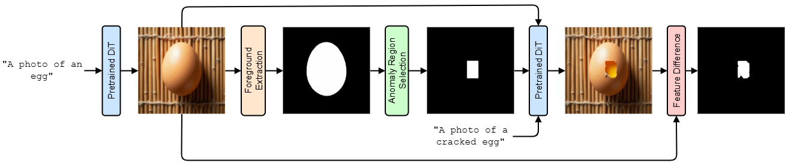
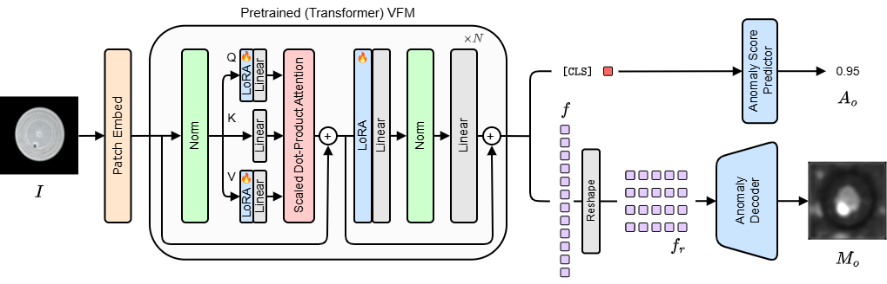
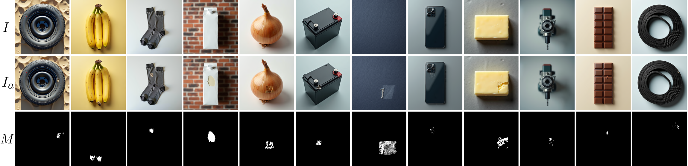

<div align="center">
<h1 align="center">[CVPR'26] AnomalyVFM</h1>

<h3>AnomalyVFM -- Transforming Vision Foundation Models into Zero-Shot Anomaly Detectors</h3>

[Matic Fučka](https://www.vicos.si/people/matic_fucka/)<sup>1 #</sup> [Vitjan Zavrtanik](https://www.vicos.si/people/vitjan_zavrtanik/)<sup>1,2 #</sup> [Danijel Skočaj](https://www.vicos.si/people/danijel_skocaj/)<sup>1</sup>

<sup>1</sup> University of Ljubljana, <sup>2</sup> \*codeplain.

<sup>#</sup> Equal contribution

[](https://arxiv.org/abs/2601.20524) [](https://maticfuc.github.io/anomaly_vfm/)


[**Overview**](#overview) | [**Get Started**](#%EF%B8%8Flets-get-started) | [**Results**](#%EF%B8%8Fresults) | [**Citation**](#reference)

</div>

## 🛎️Updates
* **` Apr. 9th, 2026`**: The models and training code for AnomalyVFM have been organized and uploaded.
* **` Feb. 20th, 2026`**: AnomalyVFM has been accepted to CVPR 2026 🔥🔥🔥

## 🚧TODO

- [x] Release the base code, pretrained weights and dataset
- [x] Upload dataset to HuggingFace
- [ ] Upload weights to HuggingFace
- [ ] Release the 3D Zero-shot Extension - Code & Paper (Goal: ~July 2026)
- [ ] Release the Full-shot Extension - Code & Paper (Goal: ~November 2026)

## 🔭Overview

* **Synthetic Dataset Generation** Anomaly-free images are created using an image generation model and then modified via inpainting to produce anomalous versions within a targeted region. Corresponding masks are generated by comparing feature-level differences between the normal and anomalous images, which also serves to filter out samples where the defect failed to generate.


<p align="center">
  
</p>


* **AnomalyVFM** AnomalyVFM adapts a pretrained backbone by injecting LoRA-based feature adaptation modules into the transformer attention layers. This refines internal representations for anomaly detection. It utilizes a convolutional decoder and a confidence-weighted loss to generate segmentation masks, a combination specifically designed to remain robust against noise in synthetic training labels.

<p align="center">
  
</p>

## 🗝️Let's Get Started!

>[!NOTE]
>Some small details differ from the paper as we found a more stable hyperparameter configuration for both synthetic dataset generation and model training. Additionally this setup currently works better for planned future extensions and when applied to new datasets outside the original paper. It is advised to use the new configuration as it trains faster and more stably. The changes will be presented in a follow-up paper.

### `A. Installation`

**Step 1: Clone the repository:**

Clone this repository and navigate to the project directory:
```bash
git clone https://github.com/MaticFuc/AnomalyVFM.git
cd AnomalyVFM
```

**Step 2: Environment Setup:**

It is recommended to set up a conda environment and installing dependencies via pip. Use the following commands to set up your environment:

***Create and activate a new conda environment***

```bash
conda create -n anomalyvfm python=3.10 pip
conda activate anomalyvfm
```

***Install dependencies***
```bash
cd flux && pip install -e .
cd ../flux2 && pip install -e .
cd .. && pip install -r requirements.txt
```


### `B. Synthetic Dataset Generation (optional, can be downloaded)`

Current setup uses FLUX.1-krea [dev] and DINOv3 ViT-L/16. A dataset generated with FLUX.2 will be released in the future.

Before running also download the [Foreground segmentor](https://drive.google.com/file/d/1XHIzgTzY5BQHw140EDIgwIb53K659ENH/view) and move it to `pretrained_models`. Additionally, the DINOv3 repository should be cloned (the path to the repo should be added to `models/dinov3.py`). Additionally, the ViT-L model should be added to `pretrained_models`. For other methods it works out of the box.

```bash
python generate_dataset.py --mode generate --n-img 10000
python generate_dataset.py --mode generate_anom --n-img 10000
python generate_dataset.py --mode filter --n-img 10000
```

<details>

<summary><strong>Optional arguments</strong></summary>

- `--img-gen-model`: Choose the image generator used to generate images (select from `flux`, `flux2`, `qwen_image`, `zimage`). By default `flux`.
- `--object-data`: Choose the Object data used to generate the images. Only `default` now.
- `--image-size`: Choose the resolution of the generated images. Tested only on 1024x1024.
- `--n-img`: Amount of images before the dataset filtering. By default 1.
- `--out-path`: Choose the output path for the generated images.
- `--seed`: Choose the seed for generation.
- `--filter-model`: Choose the pretrained backbone to derive the final mask.
- `--mode`: Choose the operational mode (`generate`, `generate_anom`, `filter`).

</details>

After this you should get results similar to the image below.

<p align="center">
  
</p>

Alternatively, you can download the dataset use the following command (will require HuggingFace authentication). The whole thing will require ~20 min:
```bash
python download_dataset.py
```


### `C. Training`

```bash
python train.py --no-eval
```

<details>

<summary><strong>Optional arguments</strong></summary>

- `--model`: Choose the backbone to adapt (possible choices: `radio`, `dinov3`, `dinov2`, `clip`, `siglip2`).
- `--peft-type`: Choose what PEFT adaptersto use (possible choices: `lora`, `dora`).
- `--peft-rank`: Choose the rank for LoRA or DoRA.

- `--data-path`: Provide the path to the training set. It should follow the same setup as our generated one.
- `--image-size`: Choose the image size for training. RADIO, DINOv3, SigLIP2 use 768 and DINOv2 and CLIP use 672. This is done to get the same feature size. 
- `--out-path`: Choose the path to store the models and the results.

- `--seed`: Choose the seed for training.
- `--batch-size`: Choose the total batch size for the model. It should be divisible by accumulation steps.
- `--accumulation-steps`: Number of gradient accumulation steps.
- `--optimizer`: Choose the optimizer for the model (possible choices: `adamw`, `adam`, `muon`). Only tested with `adamw`.
- `--learning-rate`: Choose the learning rate.
- `--weight-decay`: Choose the weight decay for the optimizer (it should be 0 for `muon`).
- `--scheduler`: Choose the scheduler for training (possible choices: `none`, `cos`, `multisteplr`, `exp`). By default `none`.

- `--train-steps`: Amount of iteration steps for training. By default 200.
- `--test-steps`: How often is the model tested. Only the final model is saved. By default 100.

- `--no-evaluate`: Whether to have evaluation during and after training.
- `--test-datasets`: Which industrial datasets to test on.
- `--medical-test-datasets-img`: Which medical datasets with only image-level labels to test on.
- `--medical-test-datasets-pix`: Which medical datasets with only pixel-level labels to test on.
- `--mean-kernel-size`: Size of the mean kernel to smooth the final prediction.

</details>


### `D. Evaluation`

**Step 1: Data Setup:**

Download the datasets below (only the ones you wish to evaluate on):

* Industrial Domain (Original paper):
[MVTec AD](https://www.mvtec.com/company/research/datasets/mvtec-ad), [VisA](https://github.com/amazon-science/spot-diff), [Real-IAD](https://huggingface.co/datasets/Real-IAD/Real-IAD), [MPDD](https://github.com/stepanje/MPDD), [BTAD](http://avires.dimi.uniud.it/papers/btad/btad.zip), [KSDD](https://www.vicos.si/resources/kolektorsdd/), [KSDD2](https://www.vicos.si/resources/kolektorsdd2/), [DAGM](https://www.kaggle.com/datasets/mhskjelvareid/dagm-2007-competition-dataset-optical-inspection), [DTD-Synthetic](https://drive.google.com/drive/folders/10OyPzvI3H6llCZBxKxFlKWt1Pw1tkMK1)

* Medical Domain (Image Level):
[HeadCT](https://drive.google.com/file/d/1lSAUkgZXUFwTqyexS8km4ZZ3hW89i5aS/view?usp=sharing), [BrainMRI](https://www.kaggle.com/datasets/navoneel/brain-mri-images-for-brain-tumor-detection), [Br35H](https://www.kaggle.com/datasets/ahmedhamada0/brain-tumor-detection), 

* Medical Domain (Pixel Level) [ISIC](https://drive.google.com/file/d/1UeuKgF1QYfT1jTlYHjxKB3tRjrFHfFDR/view?usp=sharing), [CVC-ColonDB](https://figshare.com/articles/figure/Polyp_DataSet_zip/21221579), [CVC-ClinicDB](https://figshare.com/articles/figure/Polyp_DataSet_zip/21221579), [Kvasir](https://figshare.com/articles/figure/Polyp_DataSet_zip/21221579), [Endo](https://drive.google.com/file/d/1LNpLkv5ZlEUzr_RPN5rdOHaqk0SkZa3m/view), [TN3K](https://github.com/haifangong/TRFE-Net-for-thyroid-nodule-segmentation?tab=readme-ov-file).

* Industrial Domain (Beyond the original paper):
[Real-IAD Variety](https://huggingface.co/datasets/Real-IAD/Real-IAD_Variety), [GoodsAD](https://github.com/jianzhang96/GoodsAD), [RSDD](https://github.com/neu-rail-rsdds/rail_surface_anomaly_detection)

* Industrial Domain 3D (Beyond the original paper):
[MVTec 3D](https://www.mvtec.com/research-teaching/datasets/mvtec-3d-ad), [Eyecandies](https://eyecan-ai.github.io/eyecandies/download), [Real-IAD D3](https://huggingface.co/datasets/Real-IAD/Real-IAD_D3)

After downloading the data, change the dataset paths set in `datasets\dataset.py`


**Step 2: Run Evaluation:**

```bash
python test.py --model-path /path/to/folder/with/model.pkl -d <dataset_1> <dataset_2> ... <dataset_n>
```
<details>

<summary><strong>Optional arguments</strong></summary>

- `--model`: Choose the backbone to adapt (possible choices: `radio`, `dinov3`, `dinov2`, `clip`, `siglip2`).
- `--model-path`: Path to the folder with the pretrained model.
- `--peft-type`: Chose what PEFT adapters to use (possible choices: `lora`, `dora`).
- `--peft-rank`: Chose the rank of the rank for LoRA or DoRA.

- `--image-size`: Choose the image size for testing.
- `--save-images`: Flag whether to save images.
- `--no-logging`: Flag whether to disable logging.
- `--out-path`: Choose the path to store the models and the results.
- `--mean-kernel-size`: Size of the mean kernel to smooth the final prediction.

</details>

## ⚗️Results

* Average results over the datasets used in the paper can be seen in the Tables below. We also offer several new backbones. The results differ from the paper due to the new setup working better for future extensions. Detailed results are in the folder `results`. We also added results for Real-IAD Variety, Real-IAD D3, Eyecandies, MVTec 3D, GoodsAD and RSDD.

Pretrained models can be downloaded with:
```bash
bash download_checkpoints.sh
```

Industiral datasets (MVTec AD, VisA, Real-IAD, MPDD, BTAD, KSDD, KSDD2, DTD, DAGM)

| Model | Download Link | I-AUROC | I-F1 | I-AP | P-AUROC | P-F1 | P-AP | AUPRO |
| :--- | :--- | :--- | :--- | :--- | :--- | :--- | :--- | :--- |
| **RADIO** | [Download](https://drive.google.com/file/d/1jkQH_SlrD4arflLk8jXPjG-ErbZ7kEfm/view?usp=drive_link) | 94.5 | 89.2 | 93.2 | 96.3 | 44.8 | 44.1 | 89.3 |
| **DINOv2** | [Download](https://drive.google.com/file/d/1KDd2iGY_IZ_CxNLKCLKxQ8LdpwtH_dFH/view?usp=drive_link) | 90.1 | 84.0 | 86.1 | 95.4 | 42.4 | 41.4 | 85.7 |
| **DINOv3** | [Download](https://drive.google.com/file/d/1TgCH0cJytsSsUil6GG1npcB_yd_z4crQ/view?usp=drive_link) | 91.3 | 84.5 | 87.3 | 95.8 | 43.9 | 43.5 | 86.9 |
| **CLIP** | [Download](https://drive.google.com/file/d/12tv3BktV6eKYqMV90pA9qNPA-Toe70mG/view?usp=drive_link) | 90.3 | 85.6 | 89.3 | 94.6 | 41.3 | 38.8 | 86.9 |
| **SigLIP2** | [Download](https://drive.google.com/file/d/10LcEZ0wnJpk-sSFdxazQs9wHXegg0eep/view?usp=drive_link) | 91.1 | 84.3 | 85.1 | 95.7 | 43.0 | 41.9 | 86.4 |

Medical datasets - Image level (Head CT, BrainMRI, BR35H)

| Model | I-AUROC | I-F1 | I-AP |
| :--- | :--- | :--- | :--- |
| **RADIO** | 94.2 | 89.8 | 93.5 |
| **DINOv2** | 88.6 | 84.6 | 89.9 |
| **DINOv3** | 85.6 | 80.9 | 86.4 |
| **CLIP** | 90.2 | 86.8 | 90.8 |
| **SigLIP2** | 92.5 | 88.6 | 91.4 |

Medical datasets - Pixel level (ISIC, ClinicDB, ColonDB, Kvasir, Endo, TN3K)

| Model | P-AUROC | P-F1 | P-AP | AUPRO |
| :--- | :--- | :--- | :--- | :--- |
| **RADIO** | 88.8 | 59.8 | 59.1 | 82.3 |
| **DINOv2** | 88.7 | 60.8 | 63.0 | 80.9 |
| **DINOv3** | 88.2 | 58.9 | 60.0 | 80.7 |
| **CLIP** | 80.9 | 49.0 | 47.2 | 72.3 |
| **SigLIP2** | 88.4 | 58.5 | 58.0 | 81.6 |

* The following commands were used to achieve the above results using the dataset that can be downloaded.

**RADIO**: `python train.py --model radio --image-size 768 --train-steps 200 --seed 12`

**DINOv3**: `python train.py --model dinov3 --image-size 768 --train-steps 500 --seed 12`

**SigLIP2**: `python train.py --model siglip2 --image-size 768 --train-steps 300 --seed 12`

**DINOv2**: `python train.py --model dinov2 --image-size 672 --train-steps 500 --seed 12`

**CLIP**: `python train.py --model clip --image-size 672 --train-steps 500 --seed 12`

## 🖼️Predicting on single images

To test the model a single image use the following command:

```bash
python predict_single_image.py --image-path /path/to/image.png --model-path /path/to/folder/with/model.pkl
```

By default it will save it to `pred.png`

## 📜Reference

If this code or dataset contributes to your research, please kindly consider citing our paper and give this repo ⭐️ :)
```
@InProceedings{fucka2026anomaly_vfm,
    title={AnomalyVFM -- Transforming Vision Foundation Models into Zero-Shot Anomaly Detectors},
    author={Fučka, Matic and Zavrtanik, Vitjan and Skočaj, Danijel},
    booktitle = {Proceedings of the IEEE/CVF Conference on Computer Vision and Pattern Recognition (CVPR)},
    month     = {June},
    year      = {2026}
}
```

## 🤝Acknowledgments
This project is based on [FLUX](https://github.com/black-forest-labs/flux), [RADIO](https://github.com/nvlabs/radio), and the [DINO](https://github.com/facebookresearch/dinov3) family of models. Thanks for their excellent works. Also thanks to the curators of all the datasets used for the Evaluation.

## 🙋Q & A
***For any questions, please feel free to [contact us.](mailto:matic.fucka@fri.uni-lj.si) Also feel free to suggest any possible simplifications to the code.***